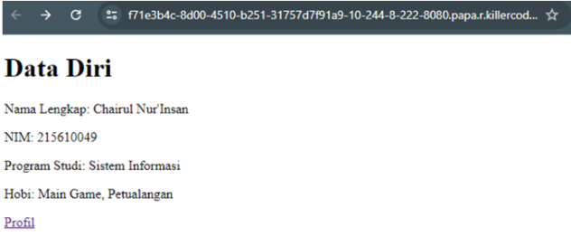
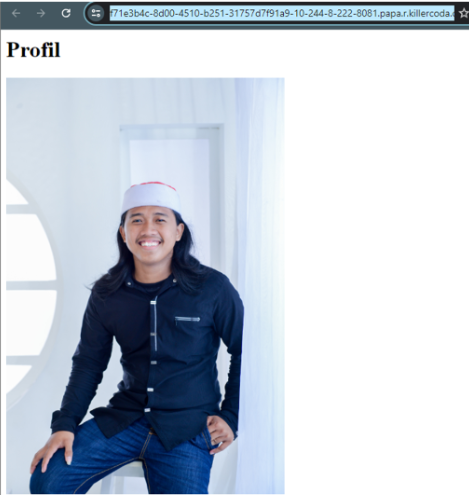

# RESPONSI-TC
- kerjakan dari website-profil terlebih Dahulu
## Buat dua direktori: website-utama dan website-profil. 
```
mkdir website-profil
mkdir website-utama
```
## Masuk kedalam masing" direktori
```
cd website-profil
cd website-utama
```
## Buat file index.html (sesuai deskripsi halaman utama).
```
<!DOCTYPE html>
<html lang="en">
<head>
    <meta charset="UTF-8">
    <title>Halaman Utama</title>
</head>
<body>
    <h1>Data Diri</h1>
    <p>Nama Lengkap: Chairul Nur'Insan</p>
    <p>NIM: 215610049</p>
    <p>Program Studi: Sistem Informasi</p>
    <p>Hobi: Main Game, Petualangan</p>
    <a href="https://f71e3b4c-8d00-4510-b251-31757d7f81a8-10-244-8-222-8081.papa.r.killercoda.com/">Profil</a>
</body>
</html>
```
## Buat file index.html (sesuai dekripsi halaman profil).
```
<!DOCTYPE html>
<html lang="en">
<head>
    <meta charset="UTF-8">
    <meta name="viewport" content="width=device-width, initial-scale=1.0">
    <title>Profil</title>
</head>
<body>
    <h1>Profil</h1>
    
</body>
</html>
```
## Membuat Dockerfile di website-profil dan website-utama
```
FROM nginx:latest
COPY . /usr/share/nginx/html
EXPOSE 80
```
## Membuat jaringan my-namamahasiswa-network
```
docker network create my-chairul-network
```
## Build Image 
```
website-profil
docker build -t website-profil .
website-utama
docker build -t website-utama .
```
## Jalankan Container Website-profil
```
docker run -d --name website-profil --network my-chairul-network -p 8081:80 website-profil
```
## Jalankan Container Website-utama
```
docker run -d --name cont_utama --network my-chairul-network -p 8080:80 website-utama
```
 # Hasil Saat Dijalankan




